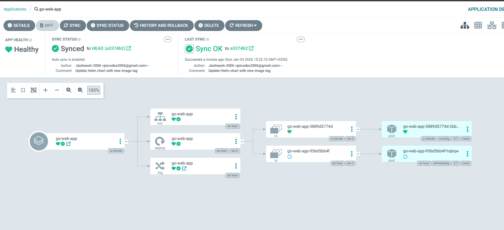
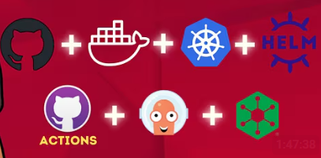

# 🎓 Student Management System

<div align="center">


**A production-ready, full-stack CRUD application with complete DevOps pipeline**

[Features](#-features) • [Architecture](#-architecture) • [Quick Start](#-quick-start) • [DevOps](#-devops-pipeline) • [API](#-api-reference)

</div>

---

## 📋 Table of Contents

- [Overview](#-overview)
- [Features](#-features)
- [Architecture](#-architecture)
- [Tech Stack](#-tech-stack)
- [Quick Start](#-quick-start)
- [DevOps Pipeline](#-devops-pipeline)
- [Kubernetes Deployment](#-kubernetes-deployment)
- [API Reference](#-api-reference)
- [Project Structure](#-project-structure)
- [Configuration](#-configuration)
- [Troubleshooting](#-troubleshooting)

---

## 🌟 Overview

A comprehensive Student Management System demonstrating modern software development practices, from full-stack development to enterprise-grade DevOps implementation. This project showcases:

- **Backend**: RESTful API built with Go, featuring clean architecture
- **Frontend**: Modern React application with TypeScript
- **DevOps**: Complete CI/CD pipeline with GitOps deployment to AWS EKS




---

## ✨ Features

### Application Features

| Feature               | Description                                      |
| --------------------- | ------------------------------------------------ |
| ✅ **Create**         | Add students with validated name, age, and email |
| ✅ **Read**           | View all students in a responsive grid layout    |
| ✅ **Update**         | Edit student details via modal interface         |
| ✅ **Delete**         | Remove students with confirmation dialog         |
| ✅ **Validation**     | Backend and frontend form validation             |
| ✅ **Error Handling** | Comprehensive error responses                    |
| ✅ **CORS Support**   | Cross-origin resource sharing enabled            |

### DevOps Features

| Feature                 | Description                                    |
| ----------------------- | ---------------------------------------------- |
| 🐳 **Containerization** | Multi-stage Docker builds for optimized images |
| ☸️ **Kubernetes**       | Production deployment on AWS EKS               |
| 🔄 **CI/CD**            | Automated pipeline with GitHub Actions         |
| 📦 **Helm Charts**      | Templated Kubernetes manifests                 |
| 🚀 **GitOps**           | ArgoCD for declarative deployments             |
| 🌐 **Ingress**          | NGINX Ingress Controller for routing           |
| 🔍 **Code Quality**     | Automated linting with golangci-lint           |

---

## 🏗 Architecture

### High-Level Architecture

```
┌─────────────────────────────────────────────────────────────────────────────┐
│                              DEVELOPER WORKFLOW                              │
├─────────────────────────────────────────────────────────────────────────────┤
│                                                                             │
│   ┌──────────┐     ┌──────────────┐     ┌──────────────┐     ┌──────────┐  │
│   │   Code   │────▶│    GitHub    │────▶│   GitHub     │────▶│  Docker  │  │
│   │   Push   │     │   Repository │     │   Actions    │     │   Hub    │  │
│   └──────────┘     └──────────────┘     └──────────────┘     └──────────┘  │
│                                                │                     │      │
│                                                ▼                     │      │
│                                    ┌──────────────────┐             │      │
│                                    │  Update Helm     │             │      │
│                                    │  Chart Image Tag │             │      │
│                                    └──────────────────┘             │      │
│                                                                     │      │
└─────────────────────────────────────────────────────────────────────│──────┘
                                                                      │
┌─────────────────────────────────────────────────────────────────────│──────┐
│                              AWS EKS CLUSTER                        │      │
├─────────────────────────────────────────────────────────────────────│──────┤
│                                                                     │      │
│   ┌──────────────┐         ┌──────────────────────────────────────┐│      │
│   │    ArgoCD    │────────▶│           Kubernetes Namespace       ││      │
│   │   (GitOps)   │         │  ┌────────────┐    ┌──────────────┐  ││      │
│   └──────────────┘         │  │   Ingress  │    │   Service    │  ││      │
│          │                 │  │   (NGINX)  │───▶│  (ClusterIP) │  ││      │
│          │                 │  └────────────┘    └──────────────┘  ││      │
│          ▼                 │                           │          ││      │
│   ┌──────────────┐         │                           ▼          ││      │
│   │  Helm Chart  │         │               ┌──────────────────┐   ││      │
│   │   Sync       │         │               │    Deployment    │◀──┘│      │
│   └──────────────┘         │               │  ┌────────────┐  │    │      │
│                            │               │  │   Pod(s)   │  │    │      │
│                            │               │  │ ┌────────┐ │  │    │      │
│                            │               │  │ │Go + React│ │  │    │      │
│                            │               │  │ └────────┘ │  │    │      │
│                            │               │  └────────────┘  │    │      │
│                            │               └──────────────────┘    │      │
│                            └───────────────────────────────────────┘      │
│                                                                           │
└───────────────────────────────────────────────────────────────────────────┘
```

### CI/CD Pipeline Flow

```
┌─────────┐    ┌─────────┐    ┌──────────────┐    ┌─────────┐    ┌──────────┐
│  Build  │───▶│  Test   │───▶│ Code Quality │───▶│  Push   │───▶│  Update  │
│   Go    │    │  Suite  │    │   Linting    │    │ Docker  │    │  Helm    │
└─────────┘    └─────────┘    └──────────────┘    └─────────┘    └──────────┘
                                                                       │
                                                                       ▼
┌───────────────────────────────────────────────────────────────────────────┐
│                           ArgoCD Auto-Sync                                │
│                    (Detects Helm values.yaml change)                     │
└───────────────────────────────────────────────────────────────────────────┘
                                                                       │
                                                                       ▼
                                                              ┌──────────────┐
                                                              │   Deploy to  │
                                                              │   AWS EKS    │
                                                              └──────────────┘
```

---

## 🛠 Tech Stack

### Backend

| Technology                  | Purpose                       |
| --------------------------- | ----------------------------- |
| **Go 1.24**                 | Primary backend language      |
| **net/http**                | HTTP server and routing       |
| **SQLite**                  | Lightweight embedded database |
| **go-playground/validator** | Request validation            |
| **cleanenv**                | Configuration management      |

### Frontend

| Technology     | Purpose                    |
| -------------- | -------------------------- |
| **React 18**   | UI component library       |
| **TypeScript** | Type-safe JavaScript       |
| **Vite**       | Next-generation build tool |
| **Axios**      | HTTP client                |
| **CSS3**       | Styling with animations    |

### DevOps & Infrastructure

| Technology         | Purpose                                  |
| ------------------ | ---------------------------------------- |
| **Docker**         | Containerization with multi-stage builds |
| **Kubernetes**     | Container orchestration                  |
| **AWS EKS**        | Managed Kubernetes service               |
| **Helm 3**         | Kubernetes package manager               |
| **ArgoCD**         | GitOps continuous delivery               |
| **GitHub Actions** | CI/CD automation                         |
| **NGINX Ingress**  | Kubernetes ingress controller            |
| **golangci-lint**  | Go code quality analysis                 |

---

## 🚀 Quick Start

### Prerequisites

| Tool    | Version | Purpose                |
| ------- | ------- | ---------------------- |
| Go      | 1.24+   | Backend development    |
| Node.js | 18+     | Frontend development   |
| Docker  | Latest  | Containerization       |
| kubectl | Latest  | Kubernetes CLI         |
| Helm    | 3.x     | Kubernetes deployments |

### Local Development

#### Option 1: Run Separately

**Terminal 1 - Backend:**

```bash
# Clone the repository
git clone https://github.com/Jaisheesh-2006/Golang-rest-api.git
cd Golang-rest-api

# Run the Go backend
go run ./cmd/students-api/main.go
```

Backend available at: `http://localhost:8080`

**Terminal 2 - Frontend:**

```bash
cd students-frontend
npm install
npm run dev
```

Frontend available at: `http://localhost:3000`

#### Option 2: Docker

```bash
# Build and run with Docker
docker build -t student-management-app .
docker run -p 8080:8080 -v $(pwd)/storage:/app/storage student-management-app
```

Application available at: `http://localhost:8080`

#### Option 3: Docker Compose

```bash
docker-compose up --build
```

---

## 🔄 DevOps Pipeline

### GitHub Actions CI/CD

The CI/CD pipeline is defined in `.github/workflows/ci.yaml` and consists of 4 stages:

#### Pipeline Stages

```yaml
┌─────────────────────────────────────────────────────────────────┐
│                        CI/CD PIPELINE                           │
├─────────────────────────────────────────────────────────────────┤
│                                                                 │
│  ┌─────────────┐                                                │
│  │   BUILD     │  • Checkout code                               │
│  │             │  • Set up Go 1.24                              │
│  │             │  • Build binary                                │
│  │             │  • Run unit tests                              │
│  └──────┬──────┘                                                │
│         │                                                       │
│         ▼                                                       │
│  ┌─────────────┐                                                │
│  │ CODE        │  • Run golangci-lint                           │
│  │ QUALITY     │  • Static analysis                             │
│  │             │  • Best practices check                        │
│  └──────┬──────┘                                                │
│         │                                                       │
│         ▼                                                       │
│  ┌─────────────┐                                                │
│  │   PUSH      │  • Build Docker image                          │
│  │   DOCKER    │  • Multi-stage build                           │
│  │             │  • Push to Docker Hub                          │
│  │             │  • Tag: github.run_id                          │
│  └──────┬──────┘                                                │
│         │                                                       │
│         ▼                                                       │
│  ┌─────────────┐                                                │
│  │  UPDATE     │  • Update Helm values.yaml                     │
│  │  HELM       │  • Commit new image tag                        │
│  │             │  • Push to repository                          │
│  │             │  • Triggers ArgoCD sync                        │
│  └─────────────┘                                                │
│                                                                 │
└─────────────────────────────────────────────────────────────────┘
```

#### Required GitHub Secrets

| Secret                | Description                         |
| --------------------- | ----------------------------------- |
| `DOCKER_HUB_USERNAME` | Docker Hub username                 |
| `DOCKER_HUB_TOKEN`    | Docker Hub access token             |
| `TOKEN`               | GitHub PAT for pushing Helm updates |

### Docker Multi-Stage Build

The Dockerfile uses a 3-stage build for optimized image size:

```dockerfile
# Stage 1: Build Frontend (Node.js)
FROM node:18-alpine AS frontend-builder
# Builds React app with Vite

# Stage 2: Build Backend (Go)
FROM golang:1.24-alpine AS backend-builder
# Compiles Go binary with CGO disabled

# Stage 3: Runtime (Distroless)
FROM gcr.io/distroless/cc-debian11
# Minimal runtime image (~20MB)
```

**Benefits:**

- 🔒 Secure: Distroless base image with no shell
- 📦 Small: Final image ~20MB
- ⚡ Fast: Optimized layer caching

---

## ☸️ Kubernetes Deployment

### Infrastructure Components

```
┌────────────────────────────────────────────────────────────────┐
│                        AWS EKS Cluster                         │
├────────────────────────────────────────────────────────────────┤
│                                                                │
│  ┌──────────────────────────────────────────────────────────┐  │
│  │                    NGINX Ingress Controller               │  │
│  │                                                          │  │
│  │  • SSL/TLS termination                                   │  │
│  │  • Path-based routing                                    │  │
│  │  • Load balancing                                        │  │
│  └──────────────────────────────────────────────────────────┘  │
│                              │                                 │
│                              ▼                                 │
│  ┌──────────────────────────────────────────────────────────┐  │
│  │                      Ingress Resource                     │  │
│  │                                                          │  │
│  │  Host: go-web-app.local                                  │  │
│  │  Path: / → go-web-app service:80                         │  │
│  └──────────────────────────────────────────────────────────┘  │
│                              │                                 │
│                              ▼                                 │
│  ┌──────────────────────────────────────────────────────────┐  │
│  │                    Service (ClusterIP)                    │  │
│  │                                                          │  │
│  │  Port: 80 → targetPort: 8080                             │  │
│  └──────────────────────────────────────────────────────────┘  │
│                              │                                 │
│                              ▼                                 │
│  ┌──────────────────────────────────────────────────────────┐  │
│  │                      Deployment                           │  │
│  │                                                          │  │
│  │  ┌────────────────┐  ┌────────────────┐                  │  │
│  │  │     Pod 1      │  │     Pod N      │                  │  │
│  │  │  ┌──────────┐  │  │  ┌──────────┐  │                  │  │
│  │  │  │ Go + React│  │  │  │ Go + React│  │                  │  │
│  │  │  │   :8080   │  │  │  │   :8080   │  │                  │  │
│  │  │  └──────────┘  │  │  └──────────┘  │                  │  │
│  │  └────────────────┘  └────────────────┘                  │  │
│  └──────────────────────────────────────────────────────────┘  │
│                                                                │
└────────────────────────────────────────────────────────────────┘
```

### Kubernetes Manifests

Located in `k8s/manifests/`:

| File              | Description                              |
| ----------------- | ---------------------------------------- |
| `deployment.yaml` | Pod specification and replica management |
| `service.yaml`    | ClusterIP service exposing port 80       |
| `ingress.yaml`    | NGINX ingress rules for external access  |

### Helm Chart

Located in `helm/go-web-app-chart/`:

```
helm/go-web-app-chart/
├── Chart.yaml          # Chart metadata
├── values.yaml         # Configurable values
└── templates/
    ├── deployment.yaml # Deployment template
    ├── service.yaml    # Service template
    └── ingress.yaml    # Ingress template
```

**Deploy with Helm:**

```bash
# Install
helm install go-web-app ./helm/go-web-app-chart

# Upgrade
helm upgrade go-web-app ./helm/go-web-app-chart

# Uninstall
helm uninstall go-web-app
```

### ArgoCD GitOps

ArgoCD monitors the Helm chart in the repository and automatically syncs changes to the cluster.

**Setup ArgoCD Application:**

```yaml
apiVersion: argoproj.io/v1alpha1
kind: Application
metadata:
  name: go-web-app
  namespace: argocd
spec:
  project: default
  source:
    repoURL: https://github.com/Jaisheesh-2006/Golang-rest-api.git
    targetRevision: main
    path: helm/go-web-app-chart
  destination:
    server: https://kubernetes.default.svc
    namespace: default
  syncPolicy:
    automated:
      prune: true
      selfHeal: true
```

---

## 📡 API Reference

**Base URL:** `http://localhost:8080/api`

### Endpoints

| Method   | Endpoint         | Description       | Request Body           |
| -------- | ---------------- | ----------------- | ---------------------- |
| `POST`   | `/students`      | Create a student  | `{ name, age, email }` |
| `GET`    | `/students`      | List all students | -                      |
| `GET`    | `/students/{id}` | Get student by ID | -                      |
| `PATCH`  | `/students/{id}` | Update student    | `{ name, age, email }` |
| `DELETE` | `/students/{id}` | Delete student    | -                      |

### Request/Response Examples

**Create Student:**

```bash
curl -X POST http://localhost:8080/api/students \
  -H "Content-Type: application/json" \
  -d '{"name": "John Doe", "age": 20, "email": "john@example.com"}'
```

**Response:**

```json
{
  "id": 1
}
```

**Get All Students:**

```bash
curl http://localhost:8080/api/students
```

**Response:**

```json
[
  {
    "id": 1,
    "name": "John Doe",
    "age": 20,
    "email": "john@example.com"
  }
]
```

### Validation Rules

| Field   | Rules                        |
| ------- | ---------------------------- |
| `name`  | Required, 2-100 characters   |
| `age`   | Required, 1-150              |
| `email` | Required, valid email format |

---

## 📁 Project Structure

```
Golang-rest-api/
├── .github/
│   └── workflows/
│       └── ci.yaml                 # GitHub Actions CI/CD pipeline
├── cmd/
│   └── students-api/
│       └── main.go                 # Application entry point
├── config/
│   └── local.yaml                  # Backend configuration
├── helm/
│   └── go-web-app-chart/           # Helm chart
│       ├── Chart.yaml
│       ├── values.yaml
│       └── templates/
│           ├── deployment.yaml
│           ├── service.yaml
│           └── ingress.yaml
├── internal/
│   ├── config/
│   │   └── config.go               # Configuration loader
│   ├── http/
│   │   └── handlers/
│   │       └── student/
│   │           └── student.go      # HTTP handlers
│   ├── storage/
│   │   ├── storage.go              # Storage interface
│   │   └── sqlite/
│   │       └── sqlite.go           # SQLite implementation
│   ├── types/
│   │   └── types.go                # Data types
│   └── utils/
│       └── responses/
│           └── responses.go        # Response helpers
├── k8s/
│   └── manifests/                  # Raw Kubernetes manifests
│       ├── deployment.yaml
│       ├── service.yaml
│       └── ingress.yaml
├── storage/
│   └── storage.db                  # SQLite database file
├── students-frontend/              # React frontend
│   ├── src/
│   │   ├── components/             # React components
│   │   ├── pages/                  # Page components
│   │   ├── services/
│   │   │   └── api.ts              # API client
│   │   └── types/
│   │       └── index.ts            # TypeScript types
│   ├── package.json
│   ├── tsconfig.json
│   └── vite.config.ts
├── Dockerfile                      # Multi-stage Docker build
├── go.mod                          # Go module dependencies
├── go.sum                          # Go dependency checksums
└── README.md                       # This file
```

---

## ⚙️ Configuration

### Backend Configuration

`config/local.yaml`:

```yaml
env: "dev"
storage_path: "storage/storage.db"
http_server:
  address: "localhost:8080"
```

### Environment Variables

| Variable      | Description         | Default               |
| ------------- | ------------------- | --------------------- |
| `CONFIG_PATH` | Path to config file | `./config/local.yaml` |

---

## 🔧 Troubleshooting

| Issue                       | Solution                                                 |
| --------------------------- | -------------------------------------------------------- |
| Backend won't start         | Ensure port 8080 is free: `lsof -i :8080`                |
| Frontend shows "Loading..." | Verify backend is running                                |
| Docker build fails          | Check Docker daemon is running                           |
| Helm install fails          | Verify kubectl context: `kubectl config current-context` |
| ArgoCD not syncing          | Check ArgoCD application status in UI                    |
| Ingress not working         | Verify NGINX Ingress Controller is installed             |
| Database errors             | Delete `storage/storage.db` and restart                  |

### Useful Commands

```bash
# Check pod status
kubectl get pods -l app=go-web-app

# View pod logs
kubectl logs -l app=go-web-app -f

# Check ArgoCD sync status
argocd app get go-web-app

# Force ArgoCD sync
argocd app sync go-web-app

# Check ingress
kubectl get ingress go-web-app
```

---

## 📚 Learning Outcomes

This project demonstrates proficiency in:

### Development

- ✅ RESTful API design with Go
- ✅ React component architecture
- ✅ TypeScript type safety
- ✅ Database design with SQLite

### DevOps

- ✅ Docker multi-stage builds
- ✅ Kubernetes resource management
- ✅ Helm chart development
- ✅ CI/CD with GitHub Actions
- ✅ GitOps with ArgoCD
- ✅ Ingress configuration
- ✅ Code quality automation

---

## 👤 Author

**Jaisheesh**

- GitHub: [@Jaisheesh-2006](https://github.com/Jaisheesh-2006)

---

## 📄 License

This project is open source and available under the [MIT License](LICENSE).

---

<div align="center">

**⭐ Star this repository if you found it helpful!**

</div>
